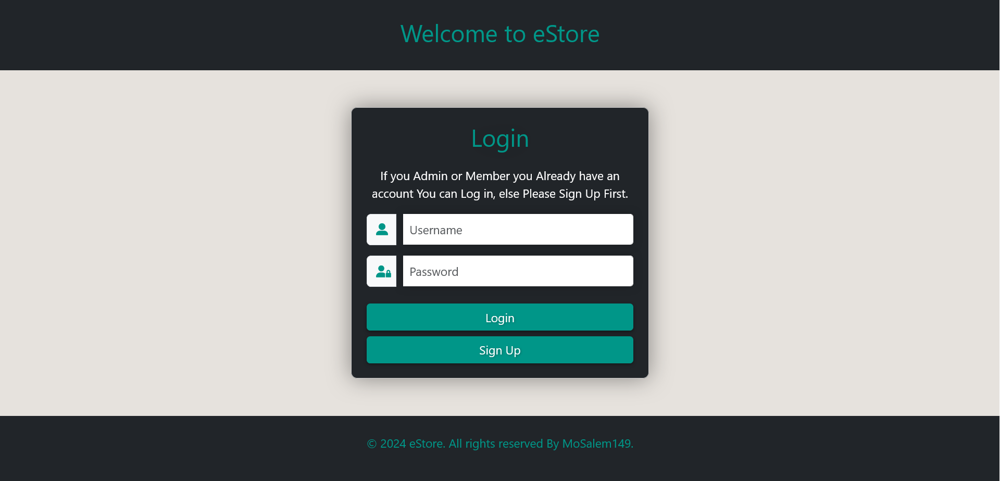
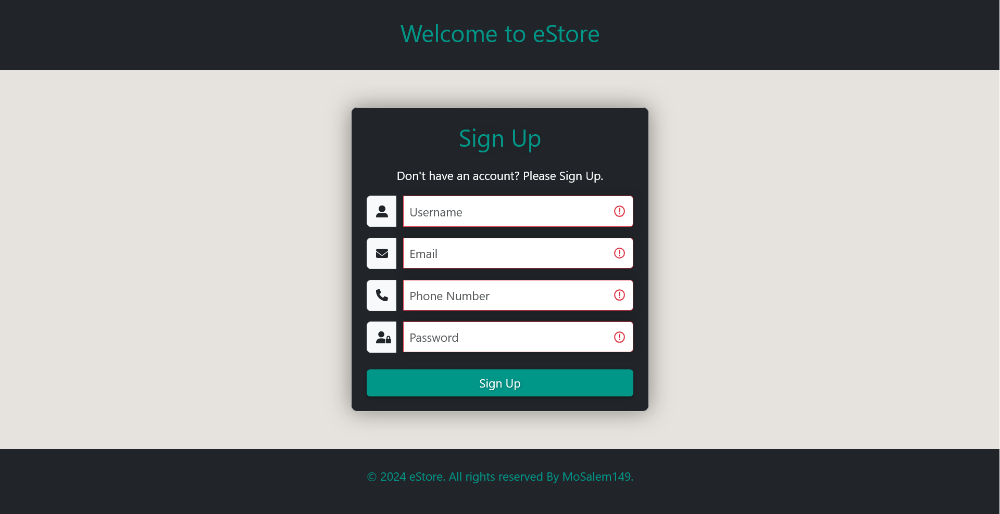
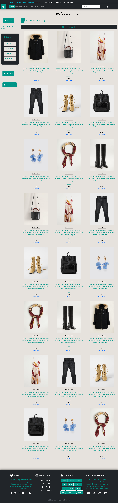

# e-store-react

A modern e-commerce store built with React. This project showcases a complete online shopping experience with features such as product listings, shopping cart, checkout, and user authentication.

## Features

- **Product Listings:** Browse through a variety of products with detailed descriptions.
- **Shopping Cart:** Add, remove, and update items in the cart.
- **User Authentication:** Sign up and log in to manage orders.
- **Responsive Design:** Fully responsive layout for all devices.

## Screenshots

Here are some screenshots of the application:

### Login 


### Sign Up


### Home Page


## Technologies Used

- **React:** Frontend library for building user interfaces.
- **React Router:** For navigation between different pages.
- **Bootstrap:** For styling the application.

## Installation

1. Clone the repository:

   ```bash
   git clone https://github.com/MoSalem149v2/e-store-react_ITI_Final_Project.git
